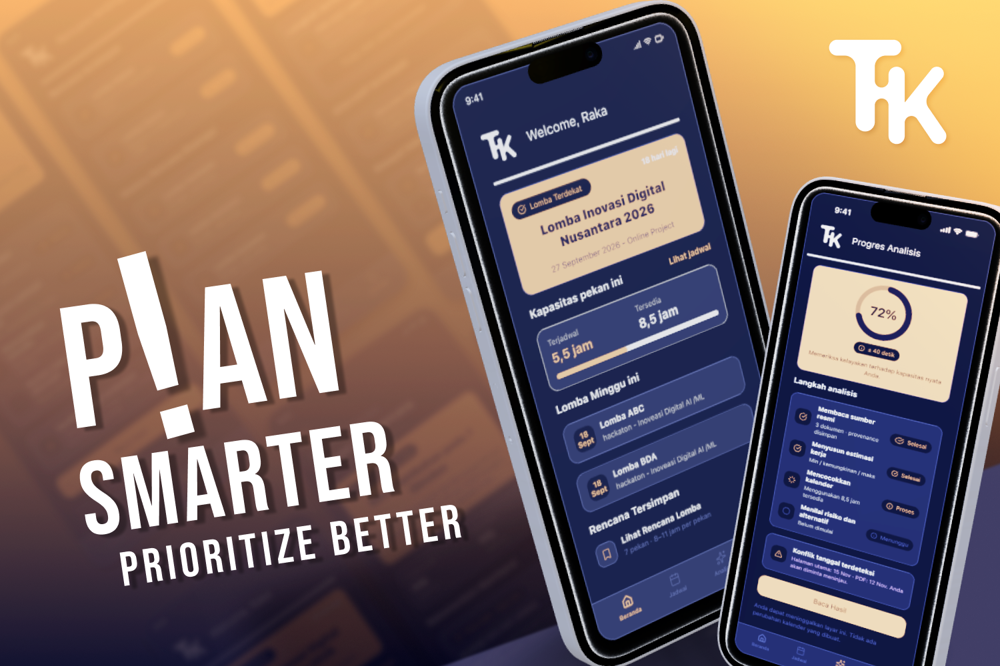
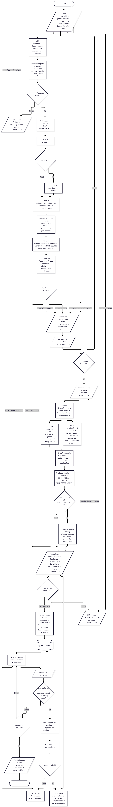
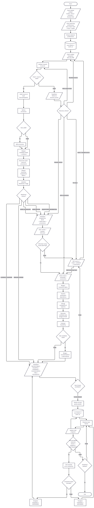
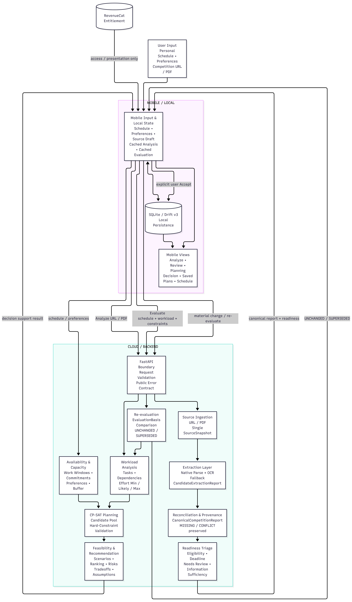
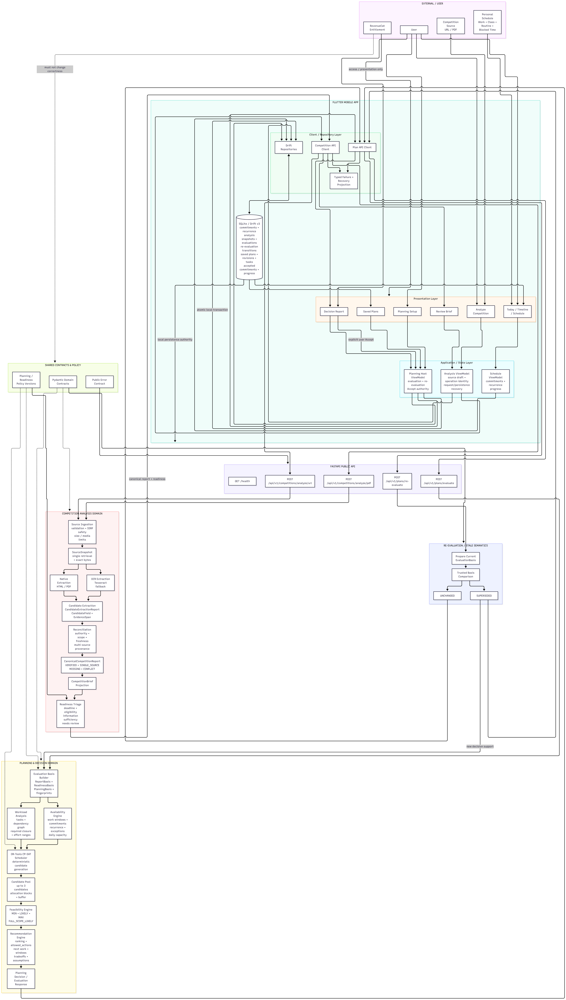

# Takt

**Calendar-aware competition decision support with provenance-backed rules, constraint-aware planning, and explicit human commitment.**

Takt helps people decide whether and how to pursue a competition or hackathon without reducing the problem to a deadline reminder or a generic task list.

The system can ingest competition material from a URL or PDF, preserve where extracted facts came from, reconcile conflicting evidence into a canonical competition brief, evaluate readiness, compare the work against the user's real availability, generate multiple valid candidate plans with OR-Tools CP-SAT, classify feasibility across workload scenarios, and assemble an advisory recommendation with rationale, trade-offs, assumptions, and trace context.

The final recommendation is **not** an automatic calendar action.

~~~text
Competition source
→ Evidence-backed canonical brief
→ Readiness
→ User constraints
→ Workload
→ Candidate planning
→ Feasibility
→ Recommendation
→ Human decision
→ Accepted local commitment
~~~

Takt is intentionally designed so that uncertainty, conflict, infeasibility, recommendation, and commitment remain different concepts.

**Default hosted API used by the mobile client:** https://takt-production-951d.up.railway.app

**iOS TestFlight:** https://testflight.apple.com/join/PEfUw9CX

**Demo video:** https://youtu.be/aa_vFMYPgjU

**Repository:** https://github.com/panjiaryasoma/Takt

**Competition context:** Shipaton 2026 MVP / release candidate

---

## Why Takt

Competition decisions look simple until the information has to survive contact with reality.

A competition can have:

- a submission deadline in a named timezone;
- a separate registration deadline;
- age, student, geographic, or team-size constraints;
- category-specific rules;
- required technologies;
- required artifacts;
- judging criteria;
- multiple official pages that disagree or supersede each other;
- a PDF whose useful content needs native extraction or OCR;
- and planning requirements that compete with classes, work, meetings, or previously accepted commitments.

Even if the competition is valid for the user, a second problem remains:

**Can the required work fit into the user's actual calendar before the deadline?**

A single total-hour estimate is not enough because tasks have dependencies, effort uncertainty, capacity limits, recurring commitments, deadlines, and different feasible arrangements.

Takt separates these responsibilities:

~~~text
source processing      → collect evidence
reconciliation         → determine canonical competition facts
readiness              → decide whether evaluation can proceed
availability           → derive usable planning capacity
workload               → represent task effort and dependencies
CP-SAT                  → build valid candidate allocations
feasibility            → classify capacity across explicit scenarios
recommendation         → explain the best supported option
human acceptance       → decide what becomes a real commitment
~~~

The system is decision support, not an autonomous scheduling agent.

---

## What Takt does

- Accepts competition material from a web URL or PDF.
- Performs defensive source retrieval and validates source limits.
- Extracts structured text from HTML and PDF content.
- Supports OCR through a bounded Tesseract-backed path when required.
- Preserves source, extraction-path, and evidence provenance.
- Normalizes supported competition facts into candidate extraction reports.
- Reconciles evidence into a versioned canonical competition report.
- Represents canonical fields explicitly as VERIFIED, SINGLE_SOURCE, CONFLICT, MISSING, or UNVERIFIED.
- Keeps critical conflicts unresolved unless deterministic authority/freshness rules justify supersession.
- Evaluates readiness separately from scheduling.
- Models user availability, recurring commitments, exceptions, accepted project commitments, and planning preferences.
- Represents task effort as minimum, likely, and maximum integer minutes.
- Validates task dependency graphs and required transitive closure.
- Builds candidate plans with OR-Tools CP-SAT.
- Re-checks candidate invariants independently of the solver.
- Evaluates feasibility across explicit workload scenarios.
- Produces multiple valid candidate plans where available.
- Assembles an advisory recommendation with rationale, trade-offs, assumptions, and suggested windows.
- Supports explicit user selection of an alternative candidate without rewriting the system-primary recommendation.
- Persists accepted plans and progress locally with SQLite + Drift.
- Supports re-evaluation when material inputs change.
- Preserves trusted stale / SUPERSEDED state instead of silently rewriting history.
- Keeps RevenueCat entitlement outside domain correctness.
- Keeps the final commitment under explicit human control.

---

## Core decision flow

The end-to-end path follows the complete decision-support lifecycle.

~~~text
URL / PDF
↓
source snapshot
↓
native extraction / OCR evidence
↓
candidate extraction
↓
reconciliation
↓
canonical competition report
↓
readiness
↓
availability + workload
↓
CP-SAT candidate plans
↓
feasibility
↓
recommendation
↓
Decision Report
↓
explicit user action
↓
local accepted plan / progress
↓
re-evaluation when material inputs change
~~~

The important separation is preserved throughout:

- source evidence is not automatically canonical truth;
- a canonical brief is not the same as readiness;
- readiness is not feasibility;
- feasibility is not recommendation;
- recommendation is not commitment;
- stale history is not silently rewritten as current truth.

### Operational flowchart

The operational flowchart shows the procedural path from source ingestion through validation, extraction, reconciliation, readiness, planning, feasibility, recommendation, persistence, recovery, and human authority.

---

## Architecture

### Simplified architecture

The simplified architecture is the judge-facing view of the system.

It keeps the main responsibility boundaries visible:

~~~text
Flutter mobile client
↓
REST / JSON
↓
FastAPI compute layer
↓
source processing
↓
canonical reasoning
↓
planning + feasibility
↓
recommendation
↓
human decision
↓
local-first persistence
~~~

The backend is primarily a stateless compute layer.

The mobile application owns personal state and accepted-plan persistence.

### Full technical architecture

The full technical architecture expands the same flow into implementation-oriented components:

- Flutter presentation and local state;
- SQLite + Drift persistence;
- RevenueCat entitlement boundary;
- FastAPI product API;
- Pydantic public contracts;
- URL/PDF ingestion;
- native extraction;
- OCR;
- reconciliation;
- readiness;
- availability;
- workload;
- CP-SAT scheduling;
- feasibility;
- recommendation;
- re-evaluation;
- public failure contracts;
- and explicit human acceptance.

The architecture intentionally avoids making a cloud database part of backend correctness.

For the MVP:

~~~text
DEVICE = personal state
SERVER = compute
~~~

---

## Data strategy

Takt uses a **contract-first data strategy** designed to preserve traceability from the original competition source to the final recommendation.

The system separates data according to its role in the decision process instead of collapsing everything into a single object.

### 1. Source evidence

Competition information can originate from:

- web URLs;
- HTML content;
- PDF documents;
- OCR-derived document content when required.

The source layer preserves provenance so extracted competition facts remain connected to where they came from.

Source processing includes defensive handling for issues such as:

- hidden HTML content;
- malformed structural markup;
- document-size limits;
- PDF page limits;
- redirect provenance;
- charset handling;
- duplicate identifiers;
- and unsafe network targets.

Source records and evidence spans retain source identity, locator information, retrieval context, extraction path, and versioned provenance.

### 2. Canonical competition data

Extracted information is normalized into structured competition contracts.

The canonical source schema includes decision-relevant fields such as:

- competition name;
- organizer;
- submission deadline;
- registration deadline;
- eligibility;
- team size;
- format;
- location;
- tracks or categories;
- deliverables;
- required technologies;
- judging criteria;
- prizes or benefits;
- source references;
- and unresolved critical fields.

Canonical field state is represented explicitly:

~~~text
VERIFIED
SINGLE_SOURCE
CONFLICT
MISSING
UNVERIFIED
~~~

Known, unknown, missing, disputed, and unverified information therefore do not collapse into the same value.

A CONFLICT field cannot expose a usable canonical value merely because one candidate has higher confidence.

Downstream planning operates on canonical structures rather than directly on raw source text.

### 3. Readiness data

Readiness is evaluated separately from planning.

The readiness layer determines whether competition information and user context are sufficient to continue safely.

Supported readiness states include:

~~~text
READY_TO_EVALUATE
NEEDS_REVIEW
ELIGIBILITY_BLOCKED
DEADLINE_PASSED
INSUFFICIENT_INFORMATION
~~~

This separation allows Takt to distinguish:

- ready cases;
- blocked cases;
- incomplete cases;
- and cases requiring additional information.

Unknown information is not automatically treated as infeasible.

### 4. User constraint data

Competition facts and user constraints are deliberately modeled separately.

User-side planning data can include:

- work windows;
- fixed commitments;
- flexible commitments;
- recurrence rules;
- recurrence exceptions;
- accepted project commitments;
- planning horizon;
- timezone;
- daily project capacity;
- preferred focus duration;
- and target buffer.

Availability uses timezone-aware minute-aligned intervals.

Accepted project commitments and busy periods take precedence over candidate planning capacity.

Takt does not need semantic private calendar titles to perform backend planning. The backend can operate on derived availability and commitment intervals.

### 5. Workload data

Takt represents scoped work as structured tasks rather than a single total-hour estimate.

Each task can retain:

- task identity;
- mandatory status;
- dependencies;
- minimum effort;
- likely effort;
- maximum effort;
- assumptions.

Canonical effort uses integer minutes.

Workload validation supports:

- minimum ≤ likely ≤ maximum;
- duplicate-ID rejection;
- dependency validation;
- cycle detection;
- deterministic topological ordering;
- transitive required-task closure;
- and strict validation of workload bounds.

This produces explicit workload scenarios that can be evaluated independently.

### 6. Planning and candidate data

Candidate plans are built from validated workload and availability data.

The planning layer accounts for:

- AVAILABLE-only scheduling;
- finish-to-start dependencies;
- daily project capacity;
- deadline clipping;
- task splitting;
- buffer policy;
- planning horizon;
- and hard plan invariants.

Candidate allocations contain typed work blocks with:

- task identity;
- start and end instants;
- allocated minutes;
- availability source.

Multiple candidate plans can be generated and evaluated without exposing internal ranking semantics as unexplained user-facing conclusions.

A solver-produced candidate is not yet a commitment.

### 7. Feasibility data

Feasibility is evaluated across explicit workload scenarios:

~~~text
MIN
LIKELY
MAX
FULL_SCOPE
~~~

The feasibility vocabulary distinguishes outcomes such as:

~~~text
FEASIBLE
FEASIBLE_WITH_TRADEOFFS
TIGHT_CAPACITY
NOT_FEASIBLE_UNDER_CURRENT_CONSTRAINTS
~~~

This avoids reducing planning uncertainty to one binary result.

UNKNOWN is not treated as INFEASIBLE.

### 8. Recommendation and trace data

Recommendations are assembled from prior evaluation outputs rather than generated independently.

The recommendation layer preserves trace context linking the result to:

- competition identity;
- report version;
- evaluation basis;
- readiness basis;
- planning basis;
- candidate plan;
- assumptions;
- suggested windows;
- rationale;
- trade-offs;
- and policy versions.

The evidence chain is:

~~~text
Source Evidence
↓
Canonical Competition Brief
↓
Readiness
↓
User Constraints
↓
Workload
↓
Candidate Planning
↓
Feasibility Evaluation
↓
Recommendation
↓
Decision Support Report
~~~

The goal is not only to produce an answer, but to preserve enough structure to explain where that answer came from.

### 9. Local accepted-state data

Takt deliberately separates computational output from user-owned accepted state.

~~~text
CandidateAllocation
↓
Recommendation
↓
Human decision
↓
Accepted plan
↓
Accepted commitment
↓
Task progress
~~~

The mobile application persists accepted truth using SQLite + Drift.

Backend evaluation does not directly write accepted calendar commitments.

---

## Logical data model

The logical ERD represents the data relationships behind Takt's decision-support lifecycle.

At a high level, the model connects:

- competition identity and brief versions;
- canonical extracted fields;
- source evidence;
- readiness state;
- workload and task structures;
- dependencies;
- user commitments;
- recurrence rules and exceptions;
- planning preferences;
- candidate plans;
- allocation blocks;
- feasibility state;
- recommendations;
- recommendation alternatives;
- accepted commitments;
- and task progress.

The model keeps source evidence, user constraints, planning state, and recommendation outputs as distinct responsibilities.

That separation matters because Takt is not simply storing a to-do list.

It preserves the chain from **what the competition says**, through **what the user can realistically do**, to **why a particular recommendation was produced**, and finally to **what the user explicitly accepted**.

The local-first persistence principle is:

~~~text
SQLite + Drift
=
primary user state

FastAPI
=
stateless compute layer

RevenueCat
=
entitlement boundary

PostgreSQL
=
not required for the current MVP
~~~

Detailed persistence design:

- docs/06_IMPLEMENTATION_HANDOFF/DATABASE_ARCHITECTURE.md

---

## Detailed technical pipeline

### 1. URL and PDF ingestion

Product endpoints accept URL or PDF competition material.

URL ingestion includes safety checks around host and network targets.

PDF ingestion enforces supported media type and bounded source size before extraction.

Source bytes and source identity are kept traceable through the extraction pipeline.

### 2. Native extraction

Native extraction handles supported source content without requiring OCR.

HTML handling includes structural normalization and defensive parsing for malformed or hidden content.

PDF native extraction preserves page-aware source material.

Native extraction failure remains a technical extraction failure. It is not converted into a domain conclusion such as MISSING.

### 3. OCR

Takt includes a Tesseract-backed OCR path with:

- provider identity;
- provider version;
- page identity;
- bounding boxes;
- confidence where available;
- timeout handling;
- provider-unavailable handling;
- and bounded resource behavior.

Native and OCR outputs become evidence candidates.

OCR is not permitted to silently overwrite canonical truth.

### 4. Candidate normalization

The current production normalizer is intentionally bounded.

It supports explicit extraction patterns required by the MVP, including supported English competition deadline and team-size representations.

Ambiguity fails closed where the current candidate contract cannot represent multiple values safely.

The parser does not claim to be a general multilingual rules parser or an LLM-based semantic extraction engine.

### 5. Reconciliation

Reconciliation combines candidate facts while preserving:

- source identity;
- extraction path;
- normalized value;
- evidence IDs;
- source authority;
- scope;
- freshness.

Canonical conflict is explicit.

A critical conflict stays unresolved unless deterministic authority/freshness policy justifies supersession.

### 6. Canonical competition report

A CanonicalCompetitionReport is versioned and includes all required SOURCE_SCHEMA core fields.

Every canonical candidate retains provenance.

Unresolved critical fields reference fields that are still:

~~~text
CONFLICT
MISSING
UNVERIFIED
~~~

Canonical report references also retain policy and fingerprint material for integration integrity.

### 7. Readiness triage

Readiness is deterministic.

It evaluates whether the current competition report and user context are sufficient to proceed.

Readiness may block evaluation because of:

- unresolved critical information;
- eligibility;
- deadline state;
- insufficient information;
- or explicit review requirements.

Readiness is not a solver result.

### 8. Availability engine

The availability engine derives planning capacity from:

~~~text
planning horizon
+
work windows
+
fixed commitments
+
flexible commitments
+
recurrence rules
+
recurrence exceptions
+
accepted project commitments
+
planning preferences
~~~

Time comparisons are instant-aware rather than naive wall-clock comparisons.

The implementation explicitly guards invalid DST gaps and ambiguous folds at the planning boundary.

### 9. Workload engine

Workload uses strict typed tasks with integer-minute effort ranges.

The engine validates:

- duplicate IDs;
- self-dependencies;
- unknown dependencies;
- cycles;
- deterministic ordering;
- required dependency closure;
- and min/likely/max consistency.

### 10. CP-SAT scheduling

Primary scheduler:

~~~text
OR-Tools CP-SAT
~~~

The scheduler builds candidate allocations under constraints such as:

- available intervals only;
- task effort requirements;
- precedence;
- deadline;
- daily capacity;
- splitting policy;
- buffer requirements.

The candidate pool is bounded and deterministic for the MVP.

### 11. Independent invariant checking

Solver output does not become trusted merely because CP-SAT returned it.

Candidate allocations are independently checked for hard violations such as:

- work outside available windows;
- interval mismatch;
- overlap;
- dependency violation;
- daily capacity violation;
- deadline violation;
- and allocation-duration inconsistency.

Only valid candidates can proceed to recommendation.

### 12. Feasibility evaluation

Feasibility evaluates multiple workload scenarios instead of pretending one effort estimate is certain.

The system can distinguish:

- clearly feasible plans;
- feasible plans with trade-offs;
- tight capacity;
- and explicit infeasibility under current constraints.

A technical execution failure is not represented as infeasibility.

### 13. Recommendation assembly

The recommendation layer consumes prior validated planning outputs.

It exposes:

- recommended candidate identity;
- recommended next work;
- suggested windows;
- rationale;
- trade-offs;
- assumptions;
- and alternatives where allowed.

The recommendation remains advisory.

### 14. Re-evaluation and stale truth

Takt can compare prior evaluation basis with current basis.

Re-evaluation preserves distinct states such as:

~~~text
UNCHANGED
SUPERSEDED
SESSION OUTDATED
~~~

A trusted SUPERSEDED transition is correctness-bearing and cannot be silently discarded.

Previously accepted historical state remains preserved.

### 15. Explicit acceptance

The final authority boundary is:

~~~text
Recommendation
↓
user confirms
↓
local transaction commits
↓
accepted truth exists
~~~

A failed local persistence operation does not become an accepted plan.

A post-commit projection/readback failure does not undo already committed truth.

---

## Local-first persistence

The Flutter application uses SQLite + Drift for personal state.

Persistence covers the release-critical state needed by the current implementation, including:

- schedule commitments;
- recurrence and exceptions;
- analysis snapshots;
- accepted plan revisions;
- accepted schedule blocks;
- task progress;
- stale evaluation state.

The release test suite verifies:

- fresh database initialization;
- supported migrations;
- restart persistence;
- transaction rollback;
- foreign-key integrity;
- accepted-plan survival;
- task-progress survival;
- stale-history preservation.

The backend does not require PostgreSQL for correctness.

A server database should only be introduced when there is a concrete server-persistence requirement such as:

- accounts;
- cross-device synchronization;
- shared team workspace;
- cloud backup;
- asynchronous jobs;
- or server-side history.

---

## Human authority and commitment boundary

Takt is advisory.

The backend may compute possibilities.

The mobile application may present those possibilities.

Neither is allowed to silently convert a suggestion into a real commitment.

~~~text
CP-SAT candidate
≠
recommendation

recommendation
≠
accepted commitment

accepted commitment
=
explicit user action + successful local transaction
~~~

This is a correctness rule, not only a UI preference.

---

## RevenueCat / Takt Pro

RevenueCat is an access boundary only.

It does **not** change:

- competition facts;
- source provenance;
- canonical field state;
- readiness;
- feasibility;
- planning inputs;
- solver output;
- recommendation truth;
- accepted-plan history.

Canonical identifiers:

~~~text
entitlement: pro
Test Store product: takt_pro_lifetime_v1
offering: default
package: $rc_lifetime
premium feature: alternative_candidates
~~~

The free experience keeps the system-primary recommendation and all domain facts available.

An active PRO entitlement unlocks the Alternative Candidate Explorer for additional valid candidates returned by the same backend evaluation.

Unknown or initial entitlement failures fail closed.

Refresh failures preserve the last trustworthy entitlement state.

For the Shipaton Android demo:

~~~bash
cd apps/mobile
cp config/revenuecat.test.example.json config/revenuecat.test.local.json

flutter run --debug \
  --dart-define-from-file=config/revenuecat.test.local.json
~~~

The local file must contain the RevenueCat public Test Store SDK key.

Secret RevenueCat keys must never be embedded in the client or committed to the repository.

---

## API

The FastAPI application is defined in apps/api/main.py.

### GET /health

Health response:

~~~json
{
  "status": "ok"
}
~~~

### POST /api/v1/competitions/analyze/url

Analyzes a competition source by URL.

The request includes competition/source metadata and may include continuation context for additional-source analysis.

The route returns a canonical report bundle plus provenance material.

Representative failure families include:

- invalid source;
- source fetch failure;
- source-size limit;
- unsupported media;
- extraction failure;
- reconciliation failure;
- report-bundle integrity failure;
- unsupported report contract.

### POST /api/v1/competitions/analyze/pdf

Analyzes one PDF source.

Multipart form boundary:

~~~text
metadata
file
~~~

The endpoint rejects unsupported form shape and unsupported PDF media type before product analysis.

### POST /api/v1/triage

Runs deterministic readiness triage.

Input:

~~~text
ReadinessRequest
~~~

Output:

~~~text
ReadinessTriage
~~~

### POST /api/v1/plans/evaluate

Evaluates a current planning request.

The product service integrates:

~~~text
canonical report
→ readiness
→ availability
→ workload
→ CP-SAT
→ feasibility
→ recommendation
~~~

The server owns the evaluation timestamp used for product correctness.

### POST /api/v1/plans/re-evaluate

Compares prior accepted/evaluated context against the current basis.

It can preserve explicit transition context for changed or failed re-evaluation paths.

The endpoint does not silently rewrite accepted local history.

### API documentation

When running locally:

~~~text
http://127.0.0.1:8000/docs
~~~

---

## Backend quick start

Requirements:

~~~text
Python 3.12
uv
Tesseract OCR for OCR-backed test/runtime paths
~~~

Install the locked dependency set:

~~~bash
uv sync --locked --dev
~~~

Start the API:

~~~bash
uv run uvicorn apps.api.main:app --reload
~~~

Open:

~~~text
http://127.0.0.1:8000
~~~

Health check:

~~~text
http://127.0.0.1:8000/health
~~~

FastAPI documentation:

~~~text
http://127.0.0.1:8000/docs
~~~

---

## Mobile quick start

Requirements:

~~~text
Flutter stable
Dart compatible with apps/mobile/pubspec.yaml
Android or iOS development toolchain
~~~

Install Flutter dependencies:

~~~bash
cd apps/mobile
flutter pub get
~~~

Run the mobile app:

~~~bash
flutter run
~~~

The mobile client reads its API base URL from:

~~~text
TAKT_API_BASE_URL
~~~

The committed default is:

~~~text
https://takt-production-951d.up.railway.app
~~~

For another backend:

~~~bash
flutter run \
  --dart-define=TAKT_API_BASE_URL=<reachable-backend-url>
~~~

---

## Technology stack

~~~yaml
backend:
  language: Python 3.12
  api: FastAPI
  validation: Pydantic v2
  http: httpx
  multipart: python-multipart
  optimization: OR-Tools CP-SAT
  pdf: PyMuPDF
  ocr: Tesseract

mobile:
  framework: Flutter
  language: Dart
  state_management: Provider
  local_database:
    - SQLite
    - Drift
  networking: http
  file_input: file_picker
  timezone: timezone
  entitlement: RevenueCat purchases_flutter

quality:
  backend_tests: pytest
  backend_lint: Ruff
  mobile_tests: flutter_test
  ci: GitHub Actions

architecture:
  backend_state: stateless compute
  primary_user_state: local-first
  server_database: none required for MVP
~~~

Takt does not use a custom-trained ML model in the current release candidate.

---

## Verification

### Backend release audit

Hari 7A completed a full backend release audit.

Audited backend runtime freeze:

~~~text
650d17ff8dabed273ab50ef5d60581697b777367
~~~

Final backend regression recorded:

~~~text
1010 passed
0 failed
0 skipped
Ruff PASS
~~~

Release evidence:

- docs/evidence/7a-backend-release-audit.md
- docs/evidence/7a-backend-samples.json

### Mobile and end-to-end release audit

Hari 7B completed a full mobile / end-to-end release audit.

Audited mobile runtime/evidence freeze:

~~~text
ab44fbe1776afe1a04adeb028aaef6c0e2017622
~~~

Final release evidence includes:

~~~text
Flutter analyze             PASS
Flutter regression          286 passed
320 px / 2x compact QA      PASS
9 screenshot render states  PASS
390 × 844 crop verification PASS
Android debug build         PASS
iOS debug build             PASS
~~~

Release evidence:

- docs/evidence/7b-mobile-release-audit.md

### Current known blocker count

~~~text
P0 / critical = 0 known
P1 / HIGH     = 0 known
~~~

The release audits preserve explicit non-blocking limitations rather than upgrading unsupported claims.

---

## Developer checks

Backend:

~~~bash
uv run ruff check apps engine packages tests scripts
uv run pytest -q
~~~

Windows helper:

~~~powershell
.\scripts\verify_backend.ps1
~~~

Mobile:

~~~bash
cd apps/mobile

flutter analyze
flutter test
flutter build apk --debug
flutter build ios --debug --no-codesign
~~~

---

## Repository structure

~~~text
Takt/
├── apps/
│   ├── api/
│   │   ├── routes/
│   │   ├── services/
│   │   ├── contracts.py
│   │   ├── errors.py
│   │   ├── fingerprints.py
│   │   └── main.py
│   │
│   └── mobile/
│       ├── android/
│       ├── ios/
│       ├── lib/
│       │   ├── config/
│       │   ├── data/
│       │   ├── models/
│       │   ├── monetization/
│       │   ├── screens/
│       │   ├── theme/
│       │   ├── viewmodels/
│       │   └── widgets/
│       └── test/
│
├── engine/
│   ├── extraction/
│   │   └── ocr/
│   ├── reconciliation/
│   ├── triage/
│   ├── availability/
│   ├── workload/
│   ├── scheduler/
│   ├── feasibility/
│   ├── recommendation/
│   └── integration/
│
├── packages/
│   └── contracts/
│
├── tests/
│   ├── api/
│   ├── availability/
│   ├── contracts/
│   ├── extraction/
│   ├── feasibility/
│   ├── integration/
│   ├── recommendation/
│   ├── reconciliation/
│   ├── reliability/
│   ├── solver/
│   ├── triage/
│   └── workload/
│
├── docs/
│   ├── 01_DISCOVERY_AND_PROBLEM/
│   ├── 02_PRODUCT_REQUIREMENTS/
│   ├── 03_EVALUATION_AND_DOMAIN_RULES/
│   ├── 05_PREPRODUCTION/
│   ├── 06_IMPLEMENTATION_HANDOFF/
│   ├── 07_RELEASE_AUDIT/
│   ├── Architecture/
│   └── evidence/
│
├── scripts/
├── pyproject.toml
├── uv.lock
├── thumbnail.png
└── README.md
~~~

---

## Behavioral authority

When implementation, prose, or historical documents disagree, use the current authority hierarchy:

1. executable implementation and tests for current behavior;
2. public error authority in tests/support/public_error_matrix.py;
3. recovery authority in tests/fixtures/reliability/recovery_policy_v1.json;
4. active preproduction contracts under docs/05_PREPRODUCTION/01_CONTRACTS_ACTIVE/;
5. implementation evidence under docs/evidence/;
6. historical drafts and planning documents as context only.

Important active references include:

~~~text
docs/05_PREPRODUCTION/01_CONTRACTS_ACTIVE/FEATURE_SCHEMA_FINAL.yaml
docs/03_EVALUATION_AND_DOMAIN_RULES/SOURCE_SCHEMA.md
docs/03_EVALUATION_AND_DOMAIN_RULES/domain_rules_v1.0.yaml
docs/06_IMPLEMENTATION_HANDOFF/DATABASE_ARCHITECTURE.md
docs/07_RELEASE_AUDIT/README.md
~~~

A documentation statement is not sufficient evidence by itself.

Release-critical claims should trace to code, tests, CI, a frozen contract, or a recorded evidence artifact.

---

## Evidence map

### Source / extraction / reconciliation

~~~text
engine/extraction/
engine/reconciliation/
tests/extraction/
tests/reconciliation/
docs/03_EVALUATION_AND_DOMAIN_RULES/SOURCE_SCHEMA.md
~~~

### Readiness

~~~text
engine/triage/
packages/contracts/triage.py
tests/triage/
~~~

### Availability and workload

~~~text
engine/availability/
engine/workload/
packages/contracts/planning.py
packages/contracts/workload.py
tests/availability/
tests/workload/
~~~

### Solver and feasibility

~~~text
engine/scheduler/
engine/feasibility/
tests/solver/
tests/feasibility/
~~~

### Recommendation and re-evaluation

~~~text
engine/recommendation/
apps/api/services/reevaluation.py
tests/recommendation/
tests/api/
~~~

### Mobile persistence and release UX

~~~text
apps/mobile/lib/
apps/mobile/test/
docs/evidence/7b-mobile-release-audit.md
~~~

### Release audits

~~~text
docs/evidence/7a-backend-release-audit.md
docs/evidence/7a-backend-samples.json
docs/evidence/7b-mobile-release-audit.md
docs/evidence/release-candidate-final.md
~~~

---

## Architecture and design references

- docs/Architecture/e2e-diagram.png — end-to-end decision-support lifecycle.
- docs/Architecture/flowchart.png — operational flow.
- docs/Architecture/simple-architecture.png — simplified judge-facing architecture.
- docs/Architecture/full-architecture.png — detailed technical architecture.
- docs/Architecture/entity-relationship-diagram.png — logical data relationships.
- docs/06_IMPLEMENTATION_HANDOFF/DATABASE_ARCHITECTURE.md — local-first persistence design.
- docs/07_RELEASE_AUDIT/README.md — release-audit authority and GO/HOLD rules.

---

## Safety and governance

Takt intentionally preserves boundaries where automation should stop.

### Source uncertainty

~~~text
CONFLICT
≠
VERIFIED

MISSING
≠
FAILURE

UNVERIFIED
≠
FALSE
~~~

### Planning uncertainty

~~~text
UNKNOWN
≠
INFEASIBLE
~~~

### Recommendation authority

~~~text
recommendation
≠
commitment
~~~

### Stale state

~~~text
SESSION OUTDATED
≠
trusted SUPERSEDED history
~~~

### Monetization

~~~text
entitlement
≠
domain correctness
~~~

These distinctions prevent UI convenience, model confidence, subscription status, or technical failure from silently changing factual truth.

---

## Known limitations

The current release candidate does **not** establish:

~~~text
general multilingual competition-rule understanding
general-purpose LLM extraction
arbitrary live-website extraction accuracy
production authentication
production rate limiting
production load certification
Railway egress-policy certification
signed Play Store distribution
signed TestFlight distribution
live RevenueCat store-transaction certification
cross-device synchronization
shared team workspace
cloud backup
server-side accepted-plan persistence
automatic calendar execution
physical-device certification for every supported layout
every locale / accessibility / OEM combination
~~~

Additional implementation limitations:

- the production candidate normalizer intentionally supports a bounded explicit grammar;
- unsupported ambiguity fails closed rather than guessing;
- OCR is bounded but not every synchronous PDF operation is guaranteed to terminate at one exact global wall-clock threshold;
- CI screenshots are Flutter-renderer evidence rather than exhaustive physical-device visual certification;
- unsaved in-memory state is not claimed to survive arbitrary OS process death;
- the current file_picker Android integration emits a future Flutter/Kotlin compatibility warning, while the audited Android debug build still passes;
- server-side persistence remains intentionally deferred.

These are documented boundaries, not hidden promises.

---

## Non-goals

The current Shipaton MVP intentionally does not attempt to become:

~~~text
a social network
a competition marketplace
a general autonomous agent
an automatic project manager
an automatic calendar writer
a multi-user collaboration suite
a cloud-sync platform
an LLM research platform
a generic document-understanding system
a production billing backend
a replacement for human competition judgment
~~~

The purpose is narrower:

**make competition decisions testable against evidence and real constraints.**

---

## Project status

Current release-audit state:

~~~yaml
backend_release_audit:
  status: GO
  known_P0: 0
  known_HIGH: 0

mobile_release_audit:
  status: GO
  known_P0: 0
  known_HIGH: 0

release_candidate:
  runtime_semantics_frozen: true
  backend_major_feature_development: closed
  mobile_major_redesign: closed
  final_evidence_note: docs/evidence/release-candidate-final.md
~~~

Both Hari 7 release audits are merged.

The release-candidate closure is documentation/evidence work and does not redefine runtime semantics.

---

## Competition context

Takt was built as a Shipaton 2026 competition decision-support MVP.

Real competition research used during discovery includes cases with:

- timezone-sensitive deadlines;
- student-specific rules;
- age and geography restrictions;
- multiple official sources;
- category-specific requirements;
- different artifact expectations;
- and heterogeneous eligibility language.

The product architecture follows from that observation:

**one competition URL is not automatically one reliable truth object.**

Evidence must be preserved, conflicts must remain visible, and planning should happen only after the system knows enough to evaluate the case safely.

---

## Claim boundary

Supported:

> Takt can ingest supported competition URL/PDF sources, preserve provenance, reconcile supported structured facts, and produce a versioned canonical competition report.

Supported:

> Takt evaluates deterministic readiness separately from planning feasibility.

Supported:

> Takt models availability and workload as typed, minute-based constraints and uses OR-Tools CP-SAT to generate bounded candidate plans.

Supported:

> Takt evaluates multiple workload scenarios and distinguishes feasibility, trade-offs, tight capacity, and infeasibility under current constraints.

Supported:

> Takt assembles advisory recommendations with trace context and preserves explicit human authority before a candidate becomes an accepted commitment.

Supported:

> Takt stores personal accepted state locally with SQLite + Drift while keeping backend planning computation stateless for the MVP.

Not supported:

~~~text
perfect extraction from arbitrary websites
general natural-language understanding
validated real-world competition success improvement
automatic autonomous project execution
automatic calendar commitment without user confirmation
cross-device cloud synchronization
production-scale multi-user infrastructure
subscription-based correctness differences
~~~

---

## Final principle

Takt separates the parts of the problem that must remain evidence-backed from the parts that can be optimized computationally.

~~~text
Preserve the source.
Keep uncertainty explicit.
Check readiness before planning.
Model the user's real constraints.
Represent effort as a range.
Generate valid alternatives.
Verify solver output.
Explain feasibility.
Keep recommendation advisory.
Require explicit acceptance.
Preserve stale history.
Let the human decide what becomes real.
~~~

The point is not to automate a person's life.

The point is to make a competition decision **traceable, testable, and realistically schedulable**.
