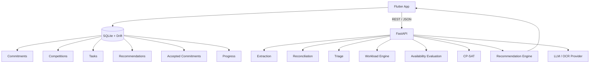
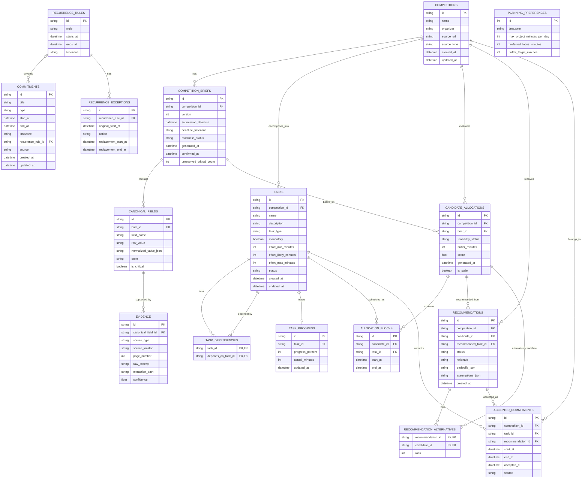
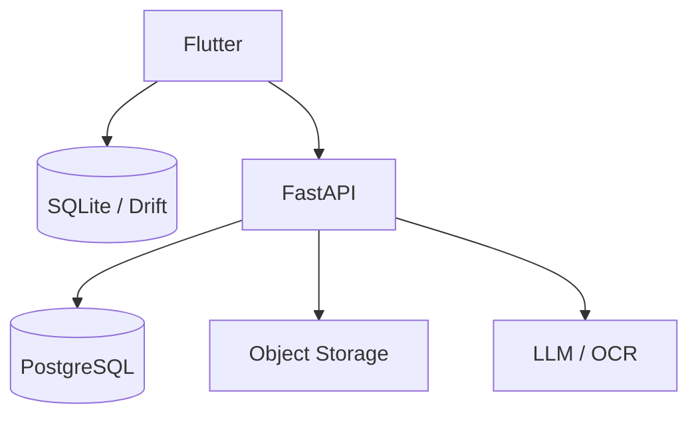

# Takt Database Architecture

**Version:** 0.1  
**Status:** Implementation Handoff Draft  
**Scope:** MVP / Shipaton  
**Primary principle:** Local-first user state, stateless backend compute.

## 1. Architecture Decision

Takt uses a local-first persistence model.

For the MVP, the user's personal state lives in the Flutter application using SQLite + Drift. The FastAPI backend acts as a compute layer for extraction, reconciliation, triage, workload analysis, feasibility evaluation, CP-SAT candidate generation, and recommendation.

```text
DEVICE = state
SERVER = compute
```

MVP baseline:

```text
Flutter App
│
├── SQLite + Drift
│   └── primary user state
│
└── REST / JSON
     ↓
FastAPI
├── extraction
├── reconciliation
├── triage
├── workload
├── availability evaluation
├── CP-SAT
└── recommendation
```

PostgreSQL is not required for the initial MVP. It should only be introduced when server-side persistence has a concrete product need.

## 2. Core Persistence Principles

### 2.1 Personal state stays local

SQLite + Drift stores:

- personal commitments;
- recurrence rules and exceptions;
- planning preferences;
- saved competitions;
- canonical competition brief cache;
- tasks and dependencies;
- candidate allocations;
- recommendations and alternatives;
- accepted commitments;
- task progress.

### 2.2 The backend should not require semantic calendar titles

The backend should receive derived planning data such as:

```text
available blocks
busy blocks
capacity
planning preferences
```

rather than personal event labels such as:

```text
"Machine Learning Class"
"Meeting with Stephen"
"Campus Assignment"
```

### 2.3 Suggestion is not commitment

The authority boundary is:

```text
CandidateAllocation
        ↓
Recommendation
        ↓
Human Decision
        ↓
AcceptedCommitment
```

Never:

```text
CP-SAT
  ↓
Calendar
```

A solver output is only a candidate until the user explicitly accepts it.

### 2.4 Derived state should not become permanent source of truth

Availability should be derived from current schedule state:

```text
commitments
+
recurrence rules
+
recurrence exceptions
+
accepted commitments
+
planning preferences
+
planning horizon
        ↓
Availability Engine
        ↓
available blocks
```

Available blocks can be recalculated when inputs change.

## 3. High-Level Architecture



## 4. Local Database Domains

```text
SQLite / Drift

CORE
├── competitions
├── competition_briefs
├── canonical_fields
└── evidence

PLANNING
├── commitments
├── recurrence_rules
├── recurrence_exceptions
├── planning_preferences
├── tasks
└── task_dependencies

DECISION SUPPORT
├── candidate_allocations
├── allocation_blocks
├── recommendations
└── recommendation_alternatives

EXECUTION
├── accepted_commitments
└── task_progress
```

## 5. Table Definitions

### 5.1 competitions

Stores the identity of a competition or opportunity.

```sql
competitions
------------
id TEXT PRIMARY KEY
name TEXT
organizer TEXT
source_url TEXT
source_type TEXT
created_at DATETIME
updated_at DATETIME
```

### 5.2 competition_briefs

Stores versioned canonical competition reports produced after extraction and reconciliation.

```sql
competition_briefs
------------------
id TEXT PRIMARY KEY
competition_id TEXT
version INTEGER
submission_deadline DATETIME
deadline_timezone TEXT
readiness_status TEXT
generated_at DATETIME
confirmed_at DATETIME
unresolved_critical_count INTEGER
```

A competition may have several brief versions:

```text
Competition
│
├── Brief v1
├── Brief v2
└── Brief v3 ← current
```

Brief history should be preserved instead of overwritten.

### 5.3 canonical_fields

Stores reconciled field values.

```sql
canonical_fields
----------------
id TEXT PRIMARY KEY
brief_id TEXT
field_name TEXT
raw_value TEXT
normalized_value_json TEXT
state TEXT
is_critical BOOLEAN
```

Allowed states:

```text
VERIFIED
SINGLE_SOURCE
CONFLICT
MISSING
UNVERIFIED
```

### 5.4 evidence

Stores provenance for canonical fields.

```sql
evidence
--------
id TEXT PRIMARY KEY
canonical_field_id TEXT
source_type TEXT
source_locator TEXT
page_number INTEGER
raw_excerpt TEXT
extraction_path TEXT
confidence REAL
```

Allowed extraction paths:

```text
NATIVE
OCR
VISION
MANUAL
```

A critical source conflict must remain a conflict until resolved. Confidence alone must not silently override contradictory evidence.

### 5.5 commitments

Stores the user's daily schedule and personal planning reality.

```sql
commitments
-----------
id TEXT PRIMARY KEY
title TEXT
type TEXT
start_at DATETIME
end_at DATETIME
timezone TEXT
recurrence_rule_id TEXT
source TEXT
created_at DATETIME
updated_at DATETIME
```

Commitment types:

```text
FIXED
FLEXIBLE
```

Example sources:

```text
MANUAL
CALENDAR_IMPORT
ACCEPTED_PROJECT_COMMITMENT
```

Daily schedules entered manually by the user belong here.

### 5.6 recurrence_rules

Stores recurrence definitions separately from commitment instances.

```sql
recurrence_rules
----------------
id TEXT PRIMARY KEY
rrule TEXT
starts_at DATETIME
ends_at DATETIME
timezone TEXT
```

Example:

```text
FREQ=WEEKLY;BYDAY=MO,WE
```

### 5.7 recurrence_exceptions

Stores one-off cancellations or modifications without mutating the original recurrence rule.

```sql
recurrence_exceptions
---------------------
id TEXT PRIMARY KEY
recurrence_rule_id TEXT
original_start_at DATETIME
action TEXT
replacement_start_at DATETIME
replacement_end_at DATETIME
```

Example:

```text
Recurring class:
Every Monday at 08:00

Exception:
Sep 29 cancelled
```

### 5.8 planning_preferences

Stores local planning constraints configured by the user.

```sql
planning_preferences
--------------------
id INTEGER PRIMARY KEY
timezone TEXT
max_project_minutes_per_day INTEGER
preferred_focus_minutes INTEGER
buffer_target_minutes INTEGER
```

### 5.9 tasks

Stores competition workload decomposition.

```sql
tasks
-----
id TEXT PRIMARY KEY
competition_id TEXT
name TEXT
description TEXT
task_type TEXT
mandatory BOOLEAN
effort_min_minutes INTEGER
effort_likely_minutes INTEGER
effort_max_minutes INTEGER
status TEXT
created_at DATETIME
updated_at DATETIME
```

Allowed task states:

```text
TODO
IN_PROGRESS
DONE
```

Effort should be represented as a range:

```text
min
likely
max
```

### 5.10 task_dependencies

Stores dependency relationships between tasks.

```sql
task_dependencies
-----------------
task_id TEXT
depends_on_task_id TEXT

PRIMARY KEY (
  task_id,
  depends_on_task_id
)
```

### 5.11 candidate_allocations

Stores solver-generated candidate plans.

```sql
candidate_allocations
---------------------
id TEXT PRIMARY KEY
competition_id TEXT
brief_id TEXT
feasibility_status TEXT
buffer_minutes INTEGER
score REAL
generated_at DATETIME
is_stale BOOLEAN
```

Allowed feasibility states:

```text
FEASIBLE
FEASIBLE_WITH_TRADEOFFS
TIGHT_CAPACITY
NOT_FEASIBLE_UNDER_CURRENT_CONSTRAINTS
```

Candidate allocations are not final schedules.

### 5.12 allocation_blocks

Stores work blocks inside a candidate allocation.

```sql
allocation_blocks
-----------------
id TEXT PRIMARY KEY
candidate_id TEXT
task_id TEXT
start_at DATETIME
end_at DATETIME
```

### 5.13 recommendations

Stores recommendation-layer outputs.

```sql
recommendations
---------------
id TEXT PRIMARY KEY
competition_id TEXT
candidate_id TEXT
recommended_task_id TEXT
status TEXT
rationale TEXT
tradeoffs_json TEXT
assumptions_json TEXT
created_at DATETIME
```

Allowed recommendation states:

```text
ACTIVE
ACCEPTED
IGNORED
STALE
```

### 5.14 recommendation_alternatives

Stores alternative candidate allocations associated with a recommendation.

```sql
recommendation_alternatives
---------------------------
recommendation_id TEXT
candidate_id TEXT
rank INTEGER
```

### 5.15 accepted_commitments

Stores competition work that the user has explicitly accepted into their real schedule.

```sql
accepted_commitments
--------------------
id TEXT PRIMARY KEY
competition_id TEXT
task_id TEXT
recommendation_id TEXT
start_at DATETIME
end_at DATETIME
accepted_at DATETIME
source TEXT
```

Example sources:

```text
RECOMMENDATION
MANUAL
```

The transition is explicit:

```text
Recommendation
      ↓
User accepts
      ↓
AcceptedCommitment
```

### 5.16 task_progress

Stores actual task execution progress.

```sql
task_progress
-------------
id TEXT PRIMARY KEY
task_id TEXT
progress_percent INTEGER
actual_minutes INTEGER
updated_at DATETIME
```

`actual_minutes` must be nullable.

```text
NULL != 0
```

No recorded effort is not equivalent to zero effort.

## 6. ERD



## 7. Backend Request Boundary

The app should send the minimum planning context required for evaluation.

Example:

```json
{
  "competition": {
    "id": "cmp_001",
    "deadline": "2026-09-30T23:45:00-07:00"
  },
  "tasks": [
    {
      "id": "task_01",
      "effort_min_minutes": 120,
      "effort_likely_minutes": 180,
      "effort_max_minutes": 240
    }
  ],
  "availability": [
    {
      "start": "2026-09-22T18:00:00+07:00",
      "end": "2026-09-22T22:00:00+07:00"
    }
  ],
  "preferences": {
    "max_project_minutes_per_day": 240,
    "preferred_focus_minutes": 90,
    "buffer_target_minutes": 360
  }
}
```

Example response:

```json
{
  "feasibility": "FEASIBLE_WITH_TRADEOFFS",
  "candidates": [
    {
      "candidate_id": "ca_001",
      "buffer_minutes": 420,
      "blocks": []
    }
  ],
  "recommendation": {
    "candidate_id": "ca_001",
    "rationale": [],
    "alternatives": []
  }
}
```

Flutter stores the returned state locally.

## 8. Server-Side Persistence

For the MVP:

```text
FastAPI = stateless
PostgreSQL = deferred
```

Server persistence should only be added for real requirements such as:

- asynchronous jobs;
- source history;
- account login;
- cross-device synchronization;
- shared team workspace;
- cloud backup;
- server-side analytics.

Future shape:



## 9. RevenueCat Boundary

RevenueCat is the entitlement source of truth.

```text
Flutter
   ↓
RevenueCat
```

Local entitlement caching is allowed, but entitlement must never become authority for domain correctness.

RevenueCat must not alter:

- deadline truth;
- eligibility truth;
- source conflicts;
- readiness blockers;
- solver correctness.

## 10. Database Invariants

```text
DB-001  recommendation != commitment
DB-002  candidate allocation != final schedule
DB-003  missing actual effort != zero effort
DB-004  canonical conflict != automatically resolved
DB-005  available blocks = derived state
DB-006  server should not require personal event titles
DB-007  RevenueCat entitlement != domain correctness
DB-008  brief updates create new versions
```

Recommendations depending on outdated brief versions must be able to become:

```text
STALE
```

## 11. MVP Final Decision

```text
SQLite + Drift
=
primary user state

FastAPI
=
stateless compute layer

PostgreSQL
=
deferred until server persistence is justified

RevenueCat
=
entitlement source of truth
```

> SQLite stores the user's reality. FastAPI computes possibilities. The recommendation layer explains options. The human decides what becomes a commitment.
