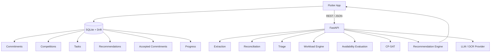
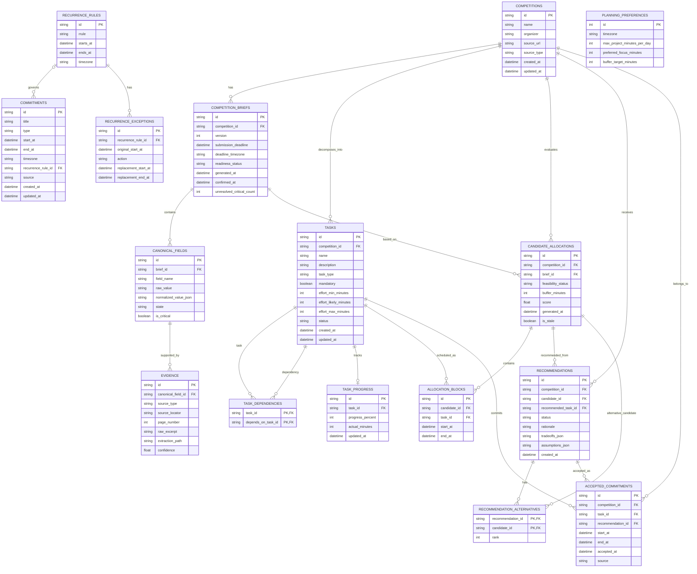
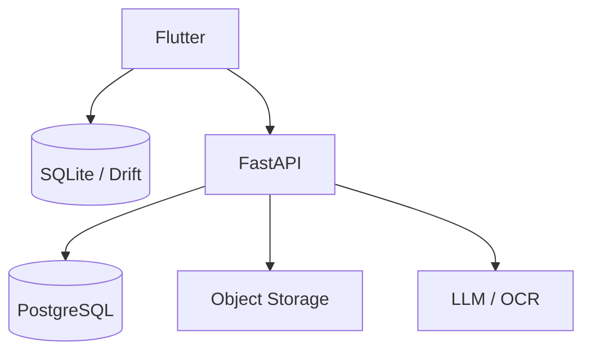

# Arsitektur Database Takt

**Versi:** 0.1  
**Status:** Draft Implementation Handoff  
**Ruang lingkup:** MVP / Shipaton  
**Prinsip utama:** state pengguna local-first, backend stateless sebagai compute layer.

## 1. Keputusan Arsitektur

Takt menggunakan model persistence **local-first**.

Untuk MVP, state personal pengguna berada di aplikasi Flutter menggunakan SQLite + Drift. Backend FastAPI berfungsi sebagai compute layer untuk extraction, reconciliation, triage, workload analysis, feasibility evaluation, pembuatan candidate dengan CP-SAT, dan recommendation.

```text
DEVICE = state
SERVER = compute
```

Baseline MVP:

```text
Flutter App
│
├── SQLite + Drift
│   └── primary user state
│
└── REST / JSON
     ↓
FastAPI
├── extraction
├── reconciliation
├── triage
├── workload
├── availability evaluation
├── CP-SAT
└── recommendation
```

PostgreSQL belum diperlukan untuk MVP awal. PostgreSQL baru ditambahkan ketika ada kebutuhan persistence server yang konkret.

## 2. Prinsip Persistence Utama

### 2.1 State personal tetap lokal

SQLite + Drift menyimpan:

- personal commitments;
- recurrence rules dan exceptions;
- planning preferences;
- competition yang disimpan;
- cache canonical competition brief;
- tasks dan dependencies;
- candidate allocations;
- recommendations dan alternatives;
- accepted commitments;
- task progress.

### 2.2 Backend tidak perlu mengetahui judul kalender personal

Backend sebaiknya menerima data planning turunan seperti:

```text
available blocks
busy blocks
capacity
planning preferences
```

bukan label event personal seperti:

```text
"Machine Learning Class"
"Meeting with Stephen"
"Campus Assignment"
```

### 2.3 Suggestion tidak sama dengan commitment

Boundary authority:

```text
CandidateAllocation
        ↓
Recommendation
        ↓
Human Decision
        ↓
AcceptedCommitment
```

Bukan:

```text
CP-SAT
  ↓
Calendar
```

Output solver hanya candidate sampai user secara eksplisit menerimanya.

### 2.4 Derived state tidak menjadi source of truth permanen

Availability diturunkan dari state jadwal saat ini:

```text
commitments
+
recurrence rules
+
recurrence exceptions
+
accepted commitments
+
planning preferences
+
planning horizon
        ↓
Availability Engine
        ↓
available blocks
```

Available blocks dapat dihitung ulang ketika input berubah.

## 3. High-Level Architecture



## 4. Domain Database Lokal

```text
SQLite / Drift

CORE
├── competitions
├── competition_briefs
├── canonical_fields
└── evidence

PLANNING
├── commitments
├── recurrence_rules
├── recurrence_exceptions
├── planning_preferences
├── tasks
└── task_dependencies

DECISION SUPPORT
├── candidate_allocations
├── allocation_blocks
├── recommendations
└── recommendation_alternatives

EXECUTION
├── accepted_commitments
└── task_progress
```

## 5. Definisi Tabel

### 5.1 competitions

Menyimpan identity competition atau opportunity.

```sql
competitions
------------
id TEXT PRIMARY KEY
name TEXT
organizer TEXT
source_url TEXT
source_type TEXT
created_at DATETIME
updated_at DATETIME
```

### 5.2 competition_briefs

Menyimpan canonical competition report yang versioned setelah extraction dan reconciliation.

```sql
competition_briefs
------------------
id TEXT PRIMARY KEY
competition_id TEXT
version INTEGER
submission_deadline DATETIME
deadline_timezone TEXT
readiness_status TEXT
generated_at DATETIME
confirmed_at DATETIME
unresolved_critical_count INTEGER
```

Satu competition dapat memiliki beberapa versi brief:

```text
Competition
│
├── Brief v1
├── Brief v2
└── Brief v3 ← current
```

Riwayat brief dipertahankan, bukan ditimpa.

### 5.3 canonical_fields

Menyimpan hasil reconciliation per field.

```sql
canonical_fields
----------------
id TEXT PRIMARY KEY
brief_id TEXT
field_name TEXT
raw_value TEXT
normalized_value_json TEXT
state TEXT
is_critical BOOLEAN
```

Allowed state:

```text
VERIFIED
SINGLE_SOURCE
CONFLICT
MISSING
UNVERIFIED
```

### 5.4 evidence

Menyimpan provenance untuk canonical field.

```sql
evidence
--------
id TEXT PRIMARY KEY
canonical_field_id TEXT
source_type TEXT
source_locator TEXT
page_number INTEGER
raw_excerpt TEXT
extraction_path TEXT
confidence REAL
```

Allowed extraction path:

```text
NATIVE
OCR
VISION
MANUAL
```

Conflict pada critical source harus tetap menjadi conflict sampai benar-benar resolved. Confidence tidak boleh otomatis menimpa evidence yang saling bertentangan.

### 5.5 commitments

Menyimpan jadwal harian dan planning reality pengguna.

```sql
commitments
-----------
id TEXT PRIMARY KEY
title TEXT
type TEXT
start_at DATETIME
end_at DATETIME
timezone TEXT
recurrence_rule_id TEXT
source TEXT
created_at DATETIME
updated_at DATETIME
```

Commitment type:

```text
FIXED
FLEXIBLE
```

Contoh source:

```text
MANUAL
CALENDAR_IMPORT
ACCEPTED_PROJECT_COMMITMENT
```

Jadwal harian yang dimasukkan manual oleh user masuk ke tabel ini.

### 5.6 recurrence_rules

Menyimpan recurrence definition secara terpisah dari instance commitment.

```sql
recurrence_rules
----------------
id TEXT PRIMARY KEY
rrule TEXT
starts_at DATETIME
ends_at DATETIME
timezone TEXT
```

Contoh:

```text
FREQ=WEEKLY;BYDAY=MO,WE
```

### 5.7 recurrence_exceptions

Menyimpan pembatalan atau perubahan satu kali tanpa mengubah recurrence rule utama.

```sql
recurrence_exceptions
---------------------
id TEXT PRIMARY KEY
recurrence_rule_id TEXT
original_start_at DATETIME
action TEXT
replacement_start_at DATETIME
replacement_end_at DATETIME
```

Contoh:

```text
Kuliah berulang:
Setiap Senin 08:00

Exception:
29 Sep dibatalkan
```

### 5.8 planning_preferences

Menyimpan planning constraint lokal yang dikonfigurasi user.

```sql
planning_preferences
--------------------
id INTEGER PRIMARY KEY
timezone TEXT
max_project_minutes_per_day INTEGER
preferred_focus_minutes INTEGER
buffer_target_minutes INTEGER
```

### 5.9 tasks

Menyimpan decomposition workload dari competition.

```sql
tasks
-----
id TEXT PRIMARY KEY
competition_id TEXT
name TEXT
description TEXT
task_type TEXT
mandatory BOOLEAN
effort_min_minutes INTEGER
effort_likely_minutes INTEGER
effort_max_minutes INTEGER
status TEXT
created_at DATETIME
updated_at DATETIME
```

Allowed task state:

```text
TODO
IN_PROGRESS
DONE
```

Effort direpresentasikan sebagai range:

```text
min
likely
max
```

### 5.10 task_dependencies

Menyimpan relasi dependency antar task.

```sql
task_dependencies
-----------------
task_id TEXT
depends_on_task_id TEXT

PRIMARY KEY (
  task_id,
  depends_on_task_id
)
```

### 5.11 candidate_allocations

Menyimpan candidate plan hasil solver.

```sql
candidate_allocations
---------------------
id TEXT PRIMARY KEY
competition_id TEXT
brief_id TEXT
feasibility_status TEXT
buffer_minutes INTEGER
score REAL
generated_at DATETIME
is_stale BOOLEAN
```

Allowed feasibility state:

```text
FEASIBLE
FEASIBLE_WITH_TRADEOFFS
TIGHT_CAPACITY
NOT_FEASIBLE_UNDER_CURRENT_CONSTRAINTS
```

Candidate allocation bukan final schedule.

### 5.12 allocation_blocks

Menyimpan work block di dalam candidate allocation.

```sql
allocation_blocks
-----------------
id TEXT PRIMARY KEY
candidate_id TEXT
task_id TEXT
start_at DATETIME
end_at DATETIME
```

### 5.13 recommendations

Menyimpan output recommendation layer.

```sql
recommendations
---------------
id TEXT PRIMARY KEY
competition_id TEXT
candidate_id TEXT
recommended_task_id TEXT
status TEXT
rationale TEXT
tradeoffs_json TEXT
assumptions_json TEXT
created_at DATETIME
```

Allowed recommendation state:

```text
ACTIVE
ACCEPTED
IGNORED
STALE
```

### 5.14 recommendation_alternatives

Menyimpan candidate alternative yang terhubung ke recommendation.

```sql
recommendation_alternatives
---------------------------
recommendation_id TEXT
candidate_id TEXT
rank INTEGER
```

### 5.15 accepted_commitments

Menyimpan pekerjaan competition yang secara eksplisit sudah diterima user menjadi bagian dari jadwal real.

```sql
accepted_commitments
--------------------
id TEXT PRIMARY KEY
competition_id TEXT
task_id TEXT
recommendation_id TEXT
start_at DATETIME
end_at DATETIME
accepted_at DATETIME
source TEXT
```

Contoh source:

```text
RECOMMENDATION
MANUAL
```

Transisinya harus eksplisit:

```text
Recommendation
      ↓
User accepts
      ↓
AcceptedCommitment
```

### 5.16 task_progress

Menyimpan progress eksekusi task.

```sql
task_progress
-------------
id TEXT PRIMARY KEY
task_id TEXT
progress_percent INTEGER
actual_minutes INTEGER
updated_at DATETIME
```

`actual_minutes` harus nullable.

```text
NULL != 0
```

Belum ada data actual effort tidak sama dengan effort nol.

## 6. ERD



## 7. Backend Request Boundary

App hanya mengirim planning context minimum yang diperlukan untuk evaluation.

Contoh:

```json
{
  "competition": {
    "id": "cmp_001",
    "deadline": "2026-09-30T23:45:00-07:00"
  },
  "tasks": [
    {
      "id": "task_01",
      "effort_min_minutes": 120,
      "effort_likely_minutes": 180,
      "effort_max_minutes": 240
    }
  ],
  "availability": [
    {
      "start": "2026-09-22T18:00:00+07:00",
      "end": "2026-09-22T22:00:00+07:00"
    }
  ],
  "preferences": {
    "max_project_minutes_per_day": 240,
    "preferred_focus_minutes": 90,
    "buffer_target_minutes": 360
  }
}
```

Contoh response:

```json
{
  "feasibility": "FEASIBLE_WITH_TRADEOFFS",
  "candidates": [
    {
      "candidate_id": "ca_001",
      "buffer_minutes": 420,
      "blocks": []
    }
  ],
  "recommendation": {
    "candidate_id": "ca_001",
    "rationale": [],
    "alternatives": []
  }
}
```

Flutter menyimpan state hasilnya secara lokal.

## 8. Server-Side Persistence

Untuk MVP:

```text
FastAPI = stateless
PostgreSQL = deferred
```

Server persistence baru ditambahkan untuk kebutuhan nyata seperti:

- asynchronous jobs;
- source history;
- account login;
- cross-device synchronization;
- shared team workspace;
- cloud backup;
- server-side analytics.

Bentuk future architecture:



## 9. Boundary RevenueCat

RevenueCat menjadi entitlement source of truth.

```text
Flutter
   ↓
RevenueCat
```

Cache entitlement lokal diperbolehkan, tetapi entitlement tidak boleh menjadi authority untuk domain correctness.

RevenueCat tidak boleh mengubah:

- deadline truth;
- eligibility truth;
- source conflicts;
- readiness blockers;
- solver correctness.

## 10. Database Invariants

```text
DB-001  recommendation != commitment
DB-002  candidate allocation != final schedule
DB-003  missing actual effort != zero effort
DB-004  canonical conflict != automatically resolved
DB-005  available blocks = derived state
DB-006  server should not require personal event titles
DB-007  RevenueCat entitlement != domain correctness
DB-008  brief updates create new versions
```

Recommendation yang bergantung pada brief lama harus dapat ditandai:

```text
STALE
```

## 11. Keputusan Final MVP

```text
SQLite + Drift
=
primary user state

FastAPI
=
stateless compute layer

PostgreSQL
=
ditunda sampai server persistence benar-benar dibutuhkan

RevenueCat
=
entitlement source of truth
```

> SQLite menyimpan realitas pengguna. FastAPI menghitung kemungkinan. Recommendation layer menjelaskan opsi. Manusia menentukan apa yang menjadi commitment.
